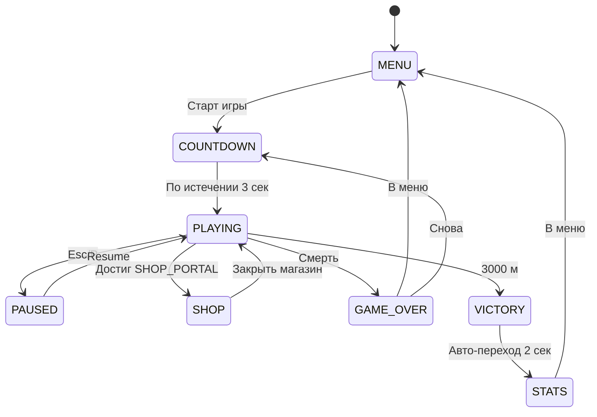

# 📋 TECH DESIGN DOCUMENT — ToLoveRunner v2.4.0

> **Тип:** Техническая документация по геймплею, дизайну и UX  
> **Статус:** Актуально (апрель 2026)  
> **Аудитория:** Разработчики, дизайнеры, QA

---

## 1. КОНЦЕПЦИЯ И НАРРАТИВ

### 1.1 Elevator Pitch
**ToLoveRunner** — это 3D endless runner с биологической тематикой в стиле образовательной комик-иллюстрации. Игрок управляет **сперматозоидом** (X- или Y-хромосомный вариант), который должен преодолеть 3 000 метров по репродуктивной системе человека, уклоняясь от иммунных клеток, бактерий и вирусов, чтобы достичь яйцеклетки.

### 1.2 Целевая аудитория
- **Основная:** 18–35 лет, любители казуальных 3D-игр с юмором (Think: Alto's Odyssey × Subway Surfers × Spore)
- **Платформы:** Desktop (primary), Mobile (responsive touch), Tablet

### 1.3 Тон и стиль
- Юмористический, нескромный, но не пошлый
- Биологически точные названия врагов (латинские) — для образовательного slant
- Нарратив подан через визуальный дизайн биомов, а не через текст

---

## 2. ГЕЙМПЛЕЙ

### 2.1 Игровой цикл (Core Loop)

```
Старт → Бег → Препятствия + Бонусы → Комбо → Shop Portal → 
→ Следующий биом → ... → Победа (3000м) / Смерть → Game Over → Старт
```

### 2.2 Управление

| Действие | Клавиатура | Touch |
|---|---|---|
| Сдвиг влево | ← / A | Свайп влево |
| Сдвиг вправо | → / D | Свайп вправо |
| Прыжок | ↑ / W / Space | Свайп вверх |
| Скольжение | ↓ / S | Свайп вниз |
| Атака (верх) | E | Кнопка-стрелка ↑ |
| Атака (низ) | Q | Кнопка-стрелка ↓ |
| Пауза | Esc / P | Кнопка ⏸ |
| Debug / PerfMon | F3 | — |

### 2.3 Полосы (Lanes)

Игра использует **5 полос** — индексы `-2, -1, 0, 1, 2`, каждая шириной **2.0 единицы** (мировые координаты Three.js).  
Переключение занимает фиксированное время при скорости перемещения `LANE_CHANGE_SPEED = 18`.

### 2.4 Speed Progression

| Дистанция | Скорость m/s |
|---|---|
| 0 – 500 м | 10 (base) → 15 |
| 500 – 1500 м | 15 → 28 |
| 1500 – 3000 м | 28 → 45 (cap) |

- Ускорение: `0.8 m/s²`, потолок `45 m/s`
- Speed Boost power-up: ×1.5 к текущей скорости

### 2.5 Прыжок и физика

| Физическая константа | Значение |
|---|---|
| Гравитация | 55 (тяжёлое приземление) |
| Сила прыжка | 15.5 |
| Высота прыжка | 2.2 юниты |
| Длительность дуги | 0.5 сек (ease-out) |
| Double Jump сила | 12.5 |
| Fall multiplier | 1.3 |
| Coyote time | 120 мс |
| Jump buffer | 180 мс |

### 2.6 Боевая система (Combat v2.4.0)

Игрок может атаковать COMBAT-врагов:
- **Атака вверх** (E/↑) — уничтожает высоких: `GLOBUS_MAXIMUS`, `MACROPHAGE_GIANT`
- **Атака вниз** (Q/↓) — уничтожает низких: `COCCUS_SIMPLEX`, `BACTERIA_LOW`
- Хиты приносят комбо и `combatScore`
- Hitbox: рассчитывается от центра игрока с offset по Y

### 2.7 Комбо-система

- Комбо накапливается при подборе бонусов и точном уклонении от врагов (graze)
- **Multiplier:** 1× → 15× (максимум)
- PERFECT тайминг (прохождение вплотную к препятствию): `+2 комбо`, золотые particles
- Таймер комбо: `comboTimer` — сбрасывается при получении урона

### 2.8 Смерть и жизни

- Стартовый запас жизней: **1**
- Membrane Shield поглощает **1 удар** от бактерий/червей
- Вирусы (`VIRUS_*`) — **мгновенная смерть** (нет поглощения)
- Game Over → экран статистики (дистанция, максимальный комбо, монеты)

---

## 3. ВРАГИ И ОБЪЕКТЫ

### 3.1 Классификация

```
Препятствия (обходятся механически)
├── OBSTACLE_JUMP    — низкие барьеры, только прыжок
├── OBSTACLE_DODGE   — высокие стены, только смещение в сторону  
└── OBSTACLE_SLIDE   — навесные, только скольжение

Черви (Globus Wormius) — трамплины
├── GLOBUS_NORMAL/ANGRY/BOSS/WORM/VULGARIS/IRRITATUS/MAXIMUS
└── VERMIS_ELECTRICUS/OSCILLANS — электрические, двигаются по синусоиде

Бактерии (Prokaryotes) — блокировщики
├── COCCUS_SIMPLEX, BACILLUS_MAGNUS, STREPTOCOCCUS_CHAIN
└── BACTERIUM_FELIX/SPORE/FLAGELLUM — имеют спец. поведение (жгутики, споры)

Вирусы (Pathogens) — летальные
├── VIRUS_KILLER_LOW/HIGH — фиксированная высота
├── VIRUS_CORONA — вращающиеся шипы
├── VIRUS_MOBILIS — движется по полосе
├── VIRUS_GIGANTUS — перекрывает несколько полос
└── VIRUS_INVISIBLE — невидимый до zone proximity

Иммунные клетки — преследователи
├── LEUKOCYTE_PATROL — патрулирует полосу
├── NEUTROPHIL_AGGRESSIVE — преследует игрока
└── MACROPHAGE_GIANT — медленный, огромный, блокирует 3 полосы

Мембраны (структуральные)
├── MEMBRANA_SIMPLEX — статичная
├── MEMBRANA_GLUTINOSA — прилипает на 0.3 сек
├── MEMBRANA_ROTANS — вращается
└── MEMBRANA_OBSCURA — темнеет viewfield
```

### 3.2 Бонусы (Powerups)

| Объект | Эффект | Длительность |
|---|---|---|
| `COIN` | +1 монета | — |
| `MAGNET` | Притягивает монеты в радиусе 8 юнит | 8 сек |
| `MEMBRANE_SHIELD` | Поглощает 1 удар | до получения урона |
| `SPEED_BOOST` | ×1.5 скорость | 5 сек |
| `DNA_HELIX` / `GENE` | Открывает DNA Card | — (legacy) |

### 3.3 DNA Card System

Карточки редкостей: `common / rare / epic / legendary`  
Эффекты: `magnet_duration`, `double_jump`, `shield_interval`, `speed_boost`, `score_multiplier`  
Уровни звёзд: 1–5 (апгрейд через магазин)

---

## 4. ДИЗАЙН И ВИЗУАЛ

### 4.1 Общий стиль

**"Биологическая комик-иллюстрация"** — Cross между научным атласом анатомии и мягким комиксом.

- **Геометрия:** органические, слегка асимметричные формы (не острые 90°)
- **Текстуры:** процедурные (шейдеры) — без текстурных атласов для экономии памяти
- **Камера:** фиксированный 3rd-person вид сзади, лёгкий наклон (~15°) для ощущения скорости
- **FOV:** 75° базовый, при SpeedBoost динамически расширяется до 85°

### 4.2 Цветовая система

**Запрещено:** нейтральные чистые RGB-цвета, неоновые оттенки в 3D-геометрии.  
**Обязательно:** матовые тёплые тона из органической палитры.

```
Flesh (основной)    #D2B48C   — игрок, нейтральный трек
Blood Red (акцент)  #8B2323   — вирусы, опасность, кнопки CTA
Yolk Yellow         #DAA520   — монеты, бонусы, комбо
Brown/Muscle        #8B4513   — стены, препятствия
Pale Skin           #DEB887   — фон, ambient light
Coral/Organ         #CD853F   — иммунные клетки, усиления
```

### 4.3 Биомы

| Биом | Основной цвет среды | Атмосфера |
|---|---|---|
| Fallopian Tube | `#1a0a2a` матовый тёмно-фиолетовый | Таинственно, узкие стены |
| Bio Jungle | `#0a2a1a` матовый тёмно-зелёный | Густая растительность, туман |
| Vein Tunnel | `#2a0a1a` матовый тёмно-красный | Пульсирующие стены |
| Egg Zone | `#2a2a0a` матовый тёмно-жёлтый | Яркий, открытый, финальный акт |
| Sperm Duct | `#1a1a2a` матовый тёмно-синий | Ускоренный, клаустрофобный |
| Ovary Corridor | `#2a1a2a` матовый тёмно-розовый | Мягкий, изгибающийся |
| Fallopian Express | `#1a2a2a` матовый тёмно-цианный | Высокая скорость |
| Immune System | `#2a2a1a` матовый тёмно-оранжевый | Агрессивный, тревожный |

Переход между биомами — плавное crossfade тумана и ambient light за 2–3 сек.

### 4.4 Игрок (Персонаж)

**X-хромосома:** Изящный, focused на Shield.  
**Y-хромосома:** Быстрый, focused на Dash.

Визуально: округлая «головка» с длинным хвостом (flagellum), органическое вращение хвоста в состоянии бега.  
Цвет определяется выбором skin (6 базовых цветов из `PLAYER_COLORS`).

### 4.5 Частицы (Particles)

| Событие | Эффект |
|---|---|
| Подбор монеты | Золотые искры (8 частиц, 0.3 сек) |
| PERFECT грейз | Золотой burst (16 частиц, ring-форма) |
| Смерть | Красно-оранжевый explosion (32 частицы, 0.8 сек) |
| Shield hit | Синеватая волна (24 частицы, bubble-форма) |
| Combo ×5/10/15 | Пёстрый screen flash (не particles, CSS overlay) |

LOD: mobile quality → `PARTICLE_COUNT × 0.1`, desktop → `× 0.5`.

---

## 5. HUD И ИНТЕРФЕЙСЫ

### 5.1 In-Game HUD

```
┌──────────────────────────────────────────────────────┐
│  [❤️ × 1]  [🛡️]     ← Верхний левый: жизни + статусы │
│                    [⚡ SPEED x1.5] ← Баффы по центру  │
│                                    [COMBO 7× ←] Правый│
│  📍 1247м               🏆 8540pts       [⏸ Pause]   │
└──────────────────────────────────────────────────────┘
```

- Фон HUD: `rgba(10, 0, 20, 0.75)` + `backdrop-filter: blur(12px)`
- Шрифт: системный sans-serif → `Inter` (Google Fonts, 400/700)
- Combo-индикатор: пульсирует при каждом приросте (scale 1.0 → 1.15 → 1.0, 150мс)

### 5.2 Главное меню

Полноэкранный 3D background (running spermatozoid loop preview).  
Кнопки: вертикальный стек, glassmorphism cards.  
Анимация входа: slide-up + fade-in (Framer Motion, 0.4 сек, stagger 0.1 сек).

Структура меню:
- **PLAY** (primary CTA, тёмно-красный gradient)
- **Выбор персонажа** (X / Y)
- **Skins / Shop**
- **Лидерборд** (моккирован до v2.3.0)
- **Настройки**
- **Обучение** (TRAINING mode)

### 5.3 Game Over экран

- Fade-out игровой сцены → тёмный overlay с `opacity: 0.85`
- Карточка: `backdrop-filter: blur(20px)`, border-radius 20px
- Контент: `[📍 Дистанция] [🏆 Очки] [⚡ Макс комбо] [💰 Монеты]`
- CTA: **Снова** / **В меню** / **(Рекорд → Share)** если новый рекорд
- Анимация: scale 0.85 → 1.0, fade-in, 0.5 сек ease-out-back

### 5.4 Счётчик обратного отсчёта (Countdown)

`3 → 2 → 1 → GO!` — крупный текст (clamp 8vw), pop анимация.  
Цвета: 3 (Blood Red), 2 (Yolk Yellow), 1 (Pale Skin), GO! (белый + glow).

### 5.5 Магазин (Shop Portal)

Открывается при достижении SHOP_PORTAL объекта на треке.  
Сетка карточек ДНК с `rarity`-цветовой кодировкой:
- Common: граница серая
- Rare: граница синяя
- Epic: граница фиолетовая
- Legendary: граница золотая + shimmer анимация

---

## 6. ПРОИЗВОДИТЕЛЬНОСТЬ

### 6.1 Целевые метрики

| Метрика | Цель | Порог предупреждения |
|---|---|---|
| FPS | 60 (stable) | < 55 |
| Draw Calls | < 50 | > 60 |
| Memory growth | < 5 KB/sec | > 10 KB/sec |
| Load time | < 2 сек | > 3 сек |

### 6.2 Стратегии оптимизации

- **Object Pooling:** все объекты трека берутся из `core/pooling/` — не создаются/удаляются в runtime
- **LOD:** дальние объекты (>400 м) рендерятся упрощённой геометрией
- **Frustum Culling:** Three.js автоматический, объекты за камерой не рендерятся
- **GPU Acceleration:** все CSS анимации через `transform` и `will-change`; `backdrop-filter` только для HUD
- **Particle Budget:** макс. 50 частиц одновременно (`SAFETY_CONFIG.MAX_PARTICLES`)
- **Collision Check:** каждый кадр для ближней зоны (< 10 м), каждые 2 кадра для дальней

### 6.3 Fallback для слабых устройств

Флаг `window.__TOLOVERUNNER_LOW_QUALITY = true`:
- DRAW_DISTANCE: 2000 → 400
- PARTICLE_COUNT: 0.5 → 0.1
- SHADOW_UPDATE_SKIP: 2 → 4

---

## 7. РЕЖИМЫ ИГРЫ

| Режим | Описание | Статус |
|---|---|---|
| `ENDLESS` | Стандартный singleplayer, цель 3000 м | ✅ Реализован |
| `TIME_ATTACK` | Гонка против таймера | 🔧 Запланирован v2.3.0 |
| `TRAINING` | Нет смерти, для обучения | ✅ Реализован |
| `RACE` | Мультиплеер — гонка | 🔧 Запланирован v2.3.0 |
| `COOP` | Мультиплеер — кооператив | 🔧 Запланирован v3.0.0 |

---

## 8. АУДИО (ПЛАНЫ)

- Фоновая музыка: ambient organic (пульсирующие биоритмы, ~70–90 BPM)
- SFX при прыжке: короткий «whoosh» с органическим overtone
- SFX при смерти: низкий гул + всплеск
- SFX при комбо: восходящая гамма (C → F → A → C octave выше)
- При потере комбо: нисходящий glissando
- Система аудио: `core/audio/` — Web Audio API через AbstractionLayer

---

## 9. ТЕХНИЧЕСКИЙ СТЕК

| Слой | Технология | Версия |
|---|---|---|
| Frontend Framework | React | 18.2.0 |
| Language | TypeScript | 5.7+ |
| 3D Engine | Three.js + React Three Fiber | 0.159 / 8.15 |
| Physics | @dimforge/rapier3d | 0.19.3 |
| State Management | Zustand | 4.5.0 |
| Animation | Framer Motion | 10.18.0 |
| Bundler | Vite | 6.0 |
| CSS | TailwindCSS v4 | 4.1 |
| Unit Tests | Vitest | 4.0 |
| E2E Tests | Playwright | 1.58 |
| Error Tracking | Sentry | 7.100 |

---

## 10. ЖИЗНЕННЫЙ ЦИКЛ ЭКРАНОВ (State Machine)



---

## 11. ВЕРСИОНИРОВАНИЕ И CHANGELOG

- Версия фиксируется в `package.json` и отображается в HUD (F3)
- При релизе: обновлять `CHANGELOG.md` + `README.md`
- Константа `APP_VERSION` берётся из `VITE_APP_VERSION` env или `package.json` — **не хардкодить**

---

*Документ синхронизирован с кодовой базой v2.4.0. Последнее обновление: 2026-04-04.*
